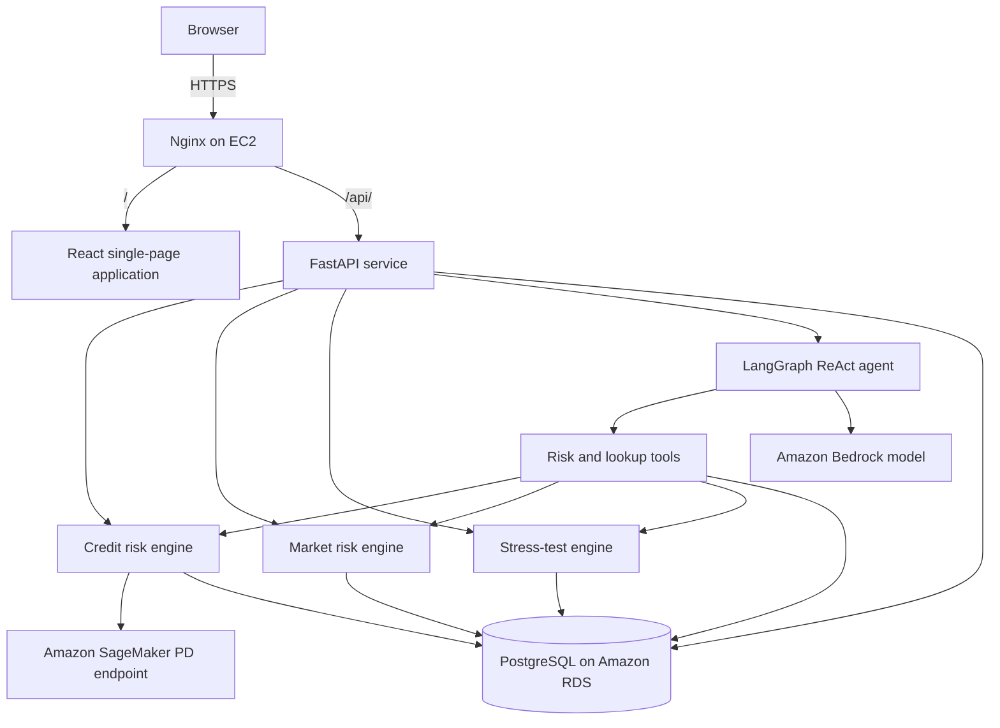
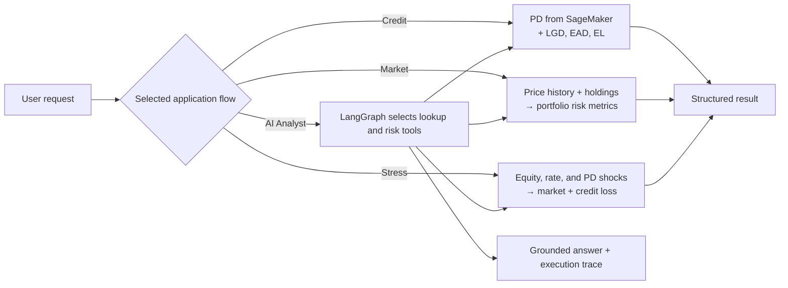

# Riskora

**AI-powered financial risk analyst platform**

Riskora brings credit risk, portfolio market risk, stress testing, and tool-grounded AI analysis into one application.

**Live → [riskora.online](https://riskora.online)**

---

## Overview

Riskora is a full-stack financial risk application. It exposes a React interface and FastAPI service for assessing borrowers and portfolios, running stress scenarios, reviewing saved results, and asking an AI analyst questions in plain language.

| Area | Implemented capability |
| --- | --- |
| Credit Risk | SageMaker-backed PD with calculated LGD, EAD, expected loss, and model-returned risk drivers |
| Market Risk | Portfolio value, volatility, historical and parametric VaR, expected shortfall, drawdown, concentration, and correlations |
| Stress Testing | Combined equity, interest-rate, and default-rate shocks across a portfolio and the active loan book |
| AI Analyst | LangGraph agent that selects risk tools and returns an answer with its actual tool-execution trace |

## Architecture

### Application architecture

### Assessment and AI workflow

## Core risk functionality

### Credit risk

For a borrower, Riskora sends the borrower feature payload to the configured SageMaker endpoint for probability of default (PD). The backend then calculates:

- **Loss given default (LGD):** `1 - recovery rate`
- **Exposure at default (EAD):** the active loan's outstanding balance
- **Expected loss (EL):** `PD × LGD × EAD`

The assessment also returns the model status, model version, configured decline threshold, and available risk drivers.

### Market risk

The market-risk engine values current holdings against stored daily prices. It calculates daily and annualized volatility, historical VaR at 95% and 99%, parametric VaR at 95%, expected shortfall at 95%, maximum drawdown, position weights, correlation, and HHI concentration.

Risk drivers are produced for a holding representing at least 20% of portfolio value and for asset pairs with return correlation of at least 0.70.

### Stress testing

Each scenario applies three inputs:

- **Equity shock:** a percentage price movement applied to equity holdings.
- **Interest-rate shock:** a basis-point movement applied to bond holdings using modified duration.
- **Default shock:** a relative increase in PD applied to the active loan book.

The output separates market loss, credit loss, and combined loss, and compares baseline and stressed portfolio value and total expected loss.

### AI analyst

The AI analyst is a LangGraph ReAct agent with these tools:

| Tool | Function |
| --- | --- |
| `get_borrower` | Retrieves a borrower profile and active loan |
| `get_portfolio` | Retrieves current portfolio holdings |
| `assess_credit_risk` | Runs the credit-risk assessment |
| `assess_market_risk` | Runs the market-risk assessment |
| `run_stress_scenario` | Runs the stress-test assessment |

The agent decides which tools are relevant to a question, receives their structured results, and returns a concise answer. Its system prompt requires each number in that answer to come from a tool result rather than from an estimate by the model.

## Product areas

- **Dashboard:** shows portfolio and loan KPIs, recent analyses, and recurring credit-risk drivers from stored results.
- **Credit Risk:** selects a borrower and displays the credit assessment.
- **Market Risk:** shows portfolio metrics, composition, historical portfolio value, correlation matrix, and risk drivers.
- **Stress Testing:** accepts scenario inputs and presents baseline-versus-stressed results.
- **AI Analyst:** accepts natural-language questions and displays the agent's execution trace.

## API

The FastAPI service is published under the `/api` prefix.

| Method | Endpoint | Purpose |
| --- | --- | --- |
| `GET` | `/api/health` | Service health check |
| `GET` | `/api/dashboard/summary` | Dashboard metrics and recent analyses |
| `GET` | `/api/credit/borrowers` | Available borrowers |
| `GET` | `/api/credit/borrowers/{borrower_id}/assess` | Credit-risk assessment; optional `explain=true` |
| `GET` | `/api/market/portfolios` | Available portfolios |
| `GET` | `/api/market/portfolios/{portfolio_id}/risk` | Market-risk assessment |
| `POST` | `/api/stress/portfolios/{portfolio_id}/run` | Run a stress scenario |
| `POST` | `/api/agent/ask` | Ask the AI analyst a question |

## Data

PostgreSQL stores borrowers, loans, payments, assets, portfolios, portfolio holdings, daily market prices, credit and market risk results, and stress-test results.

The included seed script loads a borrower sample from the configured S3 object, creates demo loans and a demo portfolio, and generates synthetic market-price history for that demo portfolio.

## Technology, AWS services, and tools

| Category | Used in this project |
| --- | --- |
| Frontend | React, React Router, Axios, Vite |
| Backend | Python, FastAPI, Uvicorn, Pydantic, SQLAlchemy |
| Data and analysis | PostgreSQL, Alembic, NumPy, pandas, SciPy |
| AI and orchestration | LangGraph, LangChain Core, LangChain AWS |
| AWS services | Amazon Bedrock, Amazon SageMaker Runtime, Amazon RDS for PostgreSQL, Amazon EC2, Amazon S3, IAM |
| Deployment and development tools | Nginx, systemd, uv, npm, AWS CLI, pytest, Ruff |
