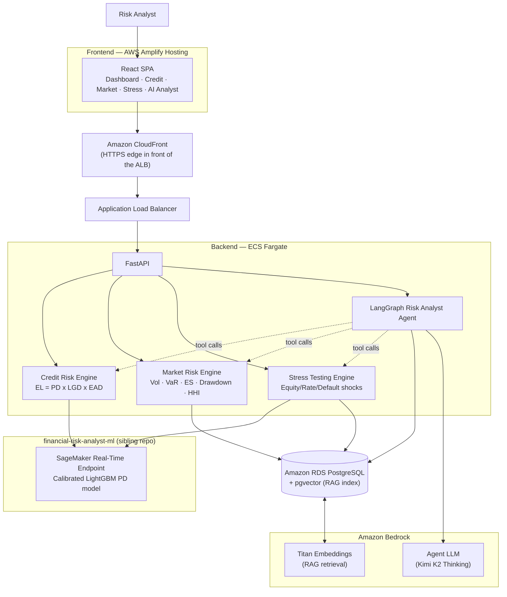

<div align="center">

# Financial Risk Analyst Platform

AI-powered financial risk analyst for financial organizations — an agentic
platform that combines deterministic quantitative finance, a trained credit
risk model, and an LLM agent on Amazon Bedrock to answer questions like
*"Assess borrower B102"* or *"What happens to portfolio P001 in a
recession?"* with a single, explained, numbers-first answer.

[](https://www.python.org/)
[](https://fastapi.tiangolo.com/)
[](https://react.dev/)
[](https://vitejs.dev/)
[](https://www.postgresql.org/)
[](https://github.com/pgvector/pgvector)
[](https://www.langchain.com/langgraph)
[](https://aws.amazon.com/bedrock/)
[](https://aws.amazon.com/sagemaker/)
[](https://aws.amazon.com/fargate/)
[](https://aws.amazon.com/amplify/)
[](https://www.docker.com/)

**Live:** [Frontend](https://master.d97yoeq2bkvvs.amplifyapp.com) ·
[Backend API](https://d18srlraorwzfk.cloudfront.net) ·
[PD Model repo (`financial-risk-analyst-ml`)](https://github.com/adhvaith267/credit-default-pd-model)

</div>

---

## Summary

Most "AI finance" demos let a language model estimate a risk number directly
— which means the number is only as trustworthy as the model's guess. This
platform takes the opposite position: **the LLM never computes a risk
figure.** Every PD, LGD, Expected Loss, VaR, Expected Shortfall, or
stress-test loss in this system comes from a trained model or a deterministic
financial formula. The agent's only job is to decide *which* of those tools
to call for a given question, and then explain the result in plain language.

```
SageMaker predicts.  Financial engines calculate.
LangGraph orchestrates.  Bedrock explains.
```

A borrower's Probability of Default comes from a real, calibrated
LightGBM model trained on the GMSC dataset and served from a SageMaker
real-time endpoint (in a [separate sibling repo](https://github.com/adhvaith267/credit-default-pd-model)).
Expected Loss, Value-at-Risk, Expected Shortfall, and stress-test losses are
plain Python/NumPy/pandas — no ML, fully auditable formulas. A LangGraph
agent on Amazon Bedrock ties it together: it reads the analyst's question,
calls the right tools (possibly several, in sequence), and writes the final
assessment — grounded, when the question is about methodology, in a small
RAG index of the platform's own documented assumptions.

## Table of Contents

- [Architecture](#architecture)
- [Features](#features)
- [Tech Stack](#tech-stack)
- [Repository Structure](#repository-structure)
- [Related Repository — the PD Model](#related-repository--the-pd-model)
- [AWS Infrastructure](#aws-infrastructure)
- [API Reference](#api-reference)
- [Getting Started](#getting-started)
- [Demo Data](#demo-data)
- [Deployment](#deployment)
- [Operating the Platform](#operating-the-platform)

## Architecture



**Why an LLM never computes a number:** SHAP-explained gradient-boosting
models and closed-form VaR/ES formulas are auditable and reproducible;
an LLM's arithmetic is neither. The agent's system prompt enforces this —
every figure in its final answer must trace back to a tool call, and if a
tool errors (unknown borrower, empty portfolio), the agent says so instead
of guessing.

## Features

| Engine | What it computes | How |
|---|---|---|
| **Credit Risk** | PD, LGD, EAD, Expected Loss, SHAP risk drivers | PD from the SageMaker-hosted LightGBM model; `EL = PD × LGD × EAD` computed deterministically |
| **Market Risk** | Volatility, historical & parametric VaR (95/99%), Expected Shortfall, max drawdown, concentration (HHI) | Historical simulation — today's portfolio weights applied to the portfolio's own historical daily returns |
| **Stress Testing** | Market loss, credit loss, combined loss under an equity/rate/default shock scenario | Equity shock hits equities directly; rate shock hits bonds via a duration approximation; default shock bumps every active loan's PD and recomputes Expected Loss |
| **AI Analyst** | A single natural-language, evidence-grounded risk assessment | LangGraph ReAct agent on Bedrock, tool-calling into the three engines plus a RAG-backed methodology search |
| **RAG** | Answers "how is X calculated" / "what assumption do you use for Y" | pgvector similarity search over the platform's own methodology docs, embedded with Titan Embed Text v2 |

## Tech Stack

| Layer | Technology |
|---|---|
| Frontend | React 18, Vite, React Router, Axios |
| Backend | FastAPI, Pydantic, SQLAlchemy 2.0, Alembic, uv |
| Database | Amazon RDS PostgreSQL 17 + `pgvector` |
| ML serving | Amazon SageMaker real-time endpoint (see the [ML repo](https://github.com/adhvaith267/credit-default-pd-model)) |
| Agent | LangGraph, LangChain, Amazon Bedrock (Converse API) |
| Embeddings | Amazon Bedrock Titan Embed Text v2 |
| Infra | Docker, Amazon ECR, ECS Fargate, Application Load Balancer, Amazon CloudFront, AWS Amplify Hosting |
| IAM | Scoped least-privilege IAM user/policy + task roles, no root credentials in the app path |

## Repository Structure

```
.
├── backend/
│   ├── app/
│   │   ├── agent/                 LangGraph tools + graph — the Risk Analyst Agent
│   │   │   ├── graph.py
│   │   │   └── tools.py
│   │   ├── api/routes/            FastAPI routers
│   │   │   ├── credit.py
│   │   │   ├── market.py
│   │   │   ├── stress.py
│   │   │   ├── agent.py
│   │   │   └── dashboard.py
│   │   ├── core/                  Settings (pydantic-settings) + DB engine/session
│   │   │   ├── config.py
│   │   │   └── db.py
│   │   ├── engines/                Pure calculation, separated from DB/SageMaker I/O
│   │   │   ├── credit_risk.py
│   │   │   ├── market_risk.py
│   │   │   ├── stress.py
│   │   │   └── retrieval.py
│   │   ├── models/                SQLAlchemy models
│   │   │   ├── borrower.py         borrowers, loans, payments
│   │   │   ├── market.py           assets, portfolios, holdings, prices
│   │   │   ├── risk.py             risk_results, stress_results
│   │   │   └── rag.py              RAG methodology chunks
│   │   ├── schemas/                Pydantic request/response models
│   │   ├── services/               SageMaker + Bedrock embedding clients
│   │   └── main.py
│   ├── alembic/                    Schema migrations
│   ├── scripts/
│   │   ├── seed_demo_data.py      Seeds borrowers/loans/portfolio
│   │   └── ingest_rag_docs.py     Chunks + embeds docs/rag/*.md into pgvector
│   ├── tests/                      pytest — pure-function unit tests per engine
│   └── Dockerfile
│
├── frontend/
│   └── src/
│       ├── pages/                  Dashboard, CreditRisk, MarketRisk, StressTesting, AIAnalyst
│       ├── components/             Sidebar, Stat, Meter, BarRow, Dumbbell, MarkdownText
│       ├── api.js                  Axios client
│       └── format.js               Currency/percent formatting helpers
│
├── docs/
│   ├── OPERATIONS.md               Start/stop, data ingestion, troubleshooting
│   ├── PHASES.md                   Chronological build log
│   └── rag/*.md                    Source documents the RAG index is built from
│
└── infra/
    ├── scripts/                    Idempotent AWS CLI provisioning, one script per phase
    │   ├── 01_provision_rds.sh
    │   ├── 05_deploy_backend_ecs.sh
    │   ├── 07_deploy_frontend_amplify.sh
    │   ├── 08_setup_cloudfront.sh
    │   └── ...
    └── fra-dev-iam-policy.json     The scoped IAM policy, kept in sync with what's deployed
```

## Related Repository — the PD Model

The Probability of Default model is deliberately a **separate repository**:
[`adhvaith267/credit-default-pd-model`](https://github.com/adhvaith267/credit-default-pd-model).

- Trained on the GMSC ("Give Me Some Credit") dataset (150K samples, ~6.68%
  default rate)
- LightGBM in production (benchmarked against XGBoost and a Logistic
  Regression baseline), Optuna-tuned, isotonic-calibrated (Brier score
  0.1421 → 0.0487, a ~65.7% reduction)
- SHAP for both global feature importance and local (per-borrower)
  adverse-action explanations
- Deployed to a SageMaker real-time endpoint (`gmsc-pd-endpoint`) via that
  repo's `scripts/deploy_sagemaker.py`

This platform **consumes** that endpoint through `app/services/sagemaker_client.py`
— it never re-implements, approximates, or bypasses the model.

## AWS Infrastructure

Everything below runs in `ap-south-1` (Mumbai) under one AWS account, behind
a scoped IAM user (`fra-platform-dev`) with no IAM/billing/Organizations
access — provisioned entirely via the scripts in `infra/scripts/`, no
console click-ops, no Terraform/CDK.

| Service | Resource(s) | Purpose |
|---|---|---|
| **Amazon RDS** | `fra-postgres-dev` (PostgreSQL 17) | Structured data + `pgvector` RAG index. **Private** — reachable only from the app's security group, never public. |
| **Amazon ECS (Fargate)** | `fra-cluster` / `fra-backend-svc` | Runs the FastAPI backend container, public subnets, no NAT Gateway |
| **Elastic Load Balancing** | `fra-backend-alb` | Application Load Balancer fronting the ECS service |
| **Amazon CloudFront** | 1 distribution | HTTPS in front of the ALB (the ALB itself is HTTP-only; CloudFront avoids needing a custom domain + ACM cert just for TLS) |
| **Amazon ECR** | `fra-backend` | Backend Docker image registry |
| **AWS Amplify Hosting** | `financial-risk-analyst-frontend` | Builds and serves the React frontend, connected to this repo via GitHub CI/CD |
| **Amazon SageMaker** | `gmsc-pd-endpoint` | PD model real-time endpoint (trained/deployed from the sibling ML repo) |
| **Amazon Bedrock** | Kimi K2 Thinking (agent LLM), Titan Embed Text v2 (RAG embeddings) | Agent reasoning/tool-use + methodology-doc retrieval |
| **Amazon S3** | `financial-risk-analyst-adhvaith-2026` | GMSC dataset + model artifacts (shared with the ML repo), RAG source docs (`rag-docs/`) |
| **Amazon EC2 (networking only)** | 1 VPC, 3 subnets, 3 security groups | Default VPC reused; `fra-alb-sg` → `fra-app-sg` → `fra-rds-sg` is the only path to the database — no EC2 instances actually run |
| **Amazon CloudWatch Logs** | `/ecs/fra-backend` | ECS task stdout/stderr |
| **AWS Secrets Manager** | `fra/rds/master-password` | RDS master password — never committed to either repo |
| **AWS IAM** | `fra-platform-dev` user, `FRA-EcsTaskExecutionRole`, `FRA-BackendTaskRole` | One scoped dev user for all CLI provisioning + two ECS task roles, each limited to exactly what that principal needs |

See `docs/PHASES.md` for the full build log, including the AWS Marketplace
billing issue that currently blocks Claude Sonnet/Opus on Bedrock (the agent
runs on Kimi K2 Thinking in the meantime — a one-line config swap once
that's resolved).

## API Reference

| Method | Path | Description |
|---|---|---|
| `GET` | `/health` | Liveness check |
| `GET` | `/dashboard/summary` | Portfolio/borrower counts + a headline market-risk snapshot |
| `GET` | `/credit/borrowers/{id}/assess` | PD, LGD, EAD, Expected Loss, SHAP risk drivers for one borrower |
| `GET` | `/market/portfolios/{id}/risk` | Volatility, VaR (95/99%), Expected Shortfall, drawdown, concentration |
| `POST` | `/stress/portfolios/{id}/run` | Runs a shock scenario, persists the result |
| `POST` | `/agent/ask` | Natural-language question → agent-orchestrated, tool-grounded answer |

## Getting Started

```bash
# Backend
cd backend
uv sync
export AWS_PROFILE=fra-dev   # local dev only — boto3 needs this explicitly
../infra/scripts/03_allow_dev_ip.sh                                  # whitelist your IP
aws rds modify-db-instance --db-instance-identifier fra-postgres-dev \
  --publicly-accessible --apply-immediately --profile fra-dev        # temporary, local dev only
../infra/scripts/02_write_env.sh
uv run alembic upgrade head
uv run uvicorn app.main:app --reload

# Frontend (separate terminal)
cd frontend
npm install
npm run dev   # http://localhost:5173, calls http://localhost:8000 by default
```

Revert RDS to private when done (`--no-publicly-accessible`) — the deployed
ECS backend never needs this at all, it reaches RDS via the security-group
path.

## Demo Data

`backend/scripts/seed_demo_data.py` (idempotent):

- **30 borrowers/loans** (`B1001`–`B1030`) sampled directly from the real
  GMSC training CSV in S3, fixed random seed — real credit-bureau
  attributes, not synthetic
- **Portfolio `P001`**: 5 assets (AAPL, MSFT, JPM, TLT, CASH) with ~2 years
  of **synthetic** price history (geometric Brownian motion, fixed seed) —
  a placeholder until real market-data ingestion (FRED / a market API)

`backend/scripts/ingest_rag_docs.py` embeds `docs/rag/*.md` into the
pgvector index.

## Deployment

```bash
infra/scripts/06_setup_ecs_iam.sh        # one-time: ECS task/execution roles
infra/scripts/05_deploy_backend_ecs.sh   # build → ECR → ECS Fargate → ALB
infra/scripts/07_deploy_frontend_amplify.sh   # connect/redeploy Amplify from GitHub
```

Pushing to `master` also auto-triggers an Amplify rebuild via its GitHub
webhook.

## Operating the Platform

Day-to-day commands — starting/stopping the backend and frontend, tearing
down the (expensive, ~$0.23/hr) SageMaker endpoint when not in use,
ingesting/refreshing RDS data, rotating the DB password, and a
troubleshooting table — live in **[`docs/OPERATIONS.md`](docs/OPERATIONS.md)**.
